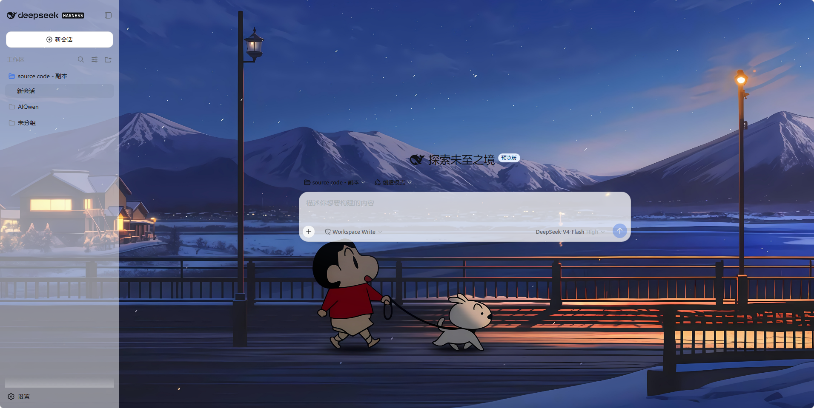
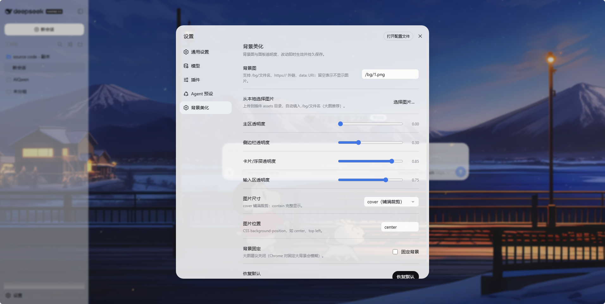

# dsh-bg-beautify

> 给 DeepSeek Harness Web UI 加背景图 + 面板半透明的美化插件，带设置页实时调节。
> A background-image & translucent-panels beautifier for the DeepSeek Harness Web UI, with a live settings page.

以官方插件机制安装，**不修改任何 DSH 源码**（`apps/web`、`packages/client` 一概不动），也**不需要重新构建前端**。

## 特性

- 🖼️ **背景图**：支持 `/bg/文件名`（插件内置伺服）、`https://` 外链、`data:` URI
- 📤 **本地图片上传**：设置页直接选文件，自动存入插件 `assets/` 并填入 `/bg/文件名`
- 🎚️ **四个透明度滑块**：主区 / 侧边栏 / 卡片浮层 / 输入区（0 全透 ～ 1 不透），即时生效
- 📐 尺寸 / 位置 / 背景固定选项；亮色、暗色主题各一套
- 💾 **持久化**：设置写入插件自己的 `config.json`，重启不丢；不依赖宿主设置服务的白名单
- 🎨 设置分区 UI 完全对齐 DSH 内置设置页的设计语言（胶囊按钮、h32 字段、主题 token）
- 🔒 仅监听回环地址（127.0.0.1）；上传文件名白名单 + 路径穿越防护

## 效果预览





## 工作原理（30 秒）

1. 本插件是一个 DSH **组合包（bundle）**：`package.json` 声明 `dsh.bundle`（贡献一行组合配置）+ `dsh.client`（声明浏览器端 bundle）。
2. 安装进 profile 后，loader 挂载 `bg-beautify` 行；`dsh-client-modules` 把 `/plugins/dsh-bg-beautify/client.js` 编入 `window.__DSH_BOOT__` 引导图，浏览器端运行时加载——**无需构建前端**。
3. 浏览器端 `apply()`：注入 `<style>` 设背景图 + 用官方主题接口 `ctx.theme.overrideTokens(...)` 覆盖面板底色（亮/暗两套）。
4. 设置持久化由插件自己的 host 半边完成（`GET/POST /bg/settings` → 插件目录 `config.json`）。

## 环境要求

- DeepSeek Harness（源码运行：Node ≥ 22 + pnpm，或已安装的 `dsh` CLI）
- 浏览器：现代 Chromium / Firefox / WebKit

## 安装

```powershell
# 从 GitHub 安装（推荐）
dsh plugin --profile web add github:halosb/dsh-bg-beautify

# 或本地目录
dsh plugin --profile web add ./dsh-bg-beautify

# 源码运行环境用
pnpm dsh plugin --profile web add ./dsh-bg-beautify
```

安装后**必须重启** `dsh web`（客户端模块的包扫描与引导图在启动时组装）：

```powershell
pnpm dsh web          # 默认端口 3080；可用 --port 换端口
```

> 本插件是纯 JS、无构建步骤，git 安装不需要 `prepare`/`allowBuilds`。

## 使用

打开 Web UI → 左下角 **设置** → **背景美化** 分区：

| 设置 | 说明 |
|---|---|
| 背景图 | 文本框：`/bg/文件名` / `https://...` / `data:image/...`；留空 = 无图 |
| 从本地选择图片 | 上传到插件 `assets/`，自动填入 `/bg/文件名` |
| 四个透明度滑块 | 主区 / 侧边栏 / 卡片浮层 / 输入区，0（全透）～ 1（不透），越小背景图越明显 |
| 尺寸 / 位置 / 背景固定 | cover / contain / auto；CSS position；大图建议取消固定（Chrome 对固定大背景会模糊） |
| 恢复默认 | **只重置四个透明度**到出厂值，背景图与显示方式不变 |

改动即时生效、持久保存。

## 默认值

| 字段 | 默认 | 说明 |
|---|---|---|
| `image` | `/bg/placeholder.svg` | 内置占位渐变图（`''` = 无图） |
| `size` / `position` / `fixed` | cover / center / false | 图片显示方式 |
| `opacityMain` | 0 | 主区 / 聊天区（0 全透 ～ 1 不透） |
| `opacitySidebar` | 0.3 | 侧边栏 |
| `opacityCard` | 0.85 | 卡片 / 浮层 |
| `opacityInput` | 0.75 | 输入区 |

## 卸载

```powershell
dsh plugin --profile web remove dsh-bg-beautify
# 重启后恢复默认外观；插件目录里的 config.json 一并删除即彻底还原
```

## 常见问题

| 现象 | 处理 |
|---|---|
| 页面无背景图 | ① 安装后必须重启 `dsh web`；② 浏览器硬刷新 Ctrl+F5 |
| `/bg/xxx.jpg` 404 | 文件名大小写不一致 / 没放进 `assets/` / 格式不支持（jpg/png/gif/webp/avif/svg） |
| 背景图发糊 | 大图取消"背景固定"（Chrome 对 fixed 大背景会低分辨率光栅化）；透明度调低让图透出来 |
| 想换端口 | `pnpm dsh web --port 8080`；`--port 0` 自动分配 |

## 仓库结构

```
dsh-bg-beautify/
├── package.json          # dsh.bundle + dsh.client 声明
├── cordis.patch.yml      # 组合层：插入 bg-beautify 行
├── client.js             # 浏览器 bundle（设置页 UI + 默认值常量）
├── index.js              # host 半边：/bg、/bg/upload、/bg/settings 三个路由
├── assets/               # 背景图（/bg/<文件名> 伺服）
├── config.json           # 运行时生成：设置持久化（已 gitignore）
├── README.md
├── 安装教程-INSTALL.zh.md
└── LICENSE
```

## 开发

- 改 `client.js` 顶部 `DEFAULTS` 可换默认值；改完重启 `dsh web` 生效。
- 客户端 bundle 内容变化需要重启（或 `pnpm run dev:web` 的 HMR watcher 正在运行）。
- 提交前请勿包含个人图片/配置（`config.json` 已在 `.gitignore`）。

## 反馈

有问题或建议，欢迎通过邮箱联系作者：

- 📮 **反馈邮箱**：i@halosb.com
- 作者：芝麻 (halosb)

## 许可证

[MIT](./LICENSE)
